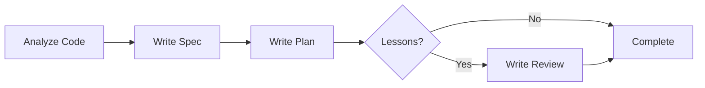

# SPIDER-LITE Protocol

A streamlined documentation protocol for completed features and existing codebases, designed for holistic documentation without the overhead of phased implementation and multi-agent consultation.

## When to Use SPIDER-LITE

Use SPIDER-LITE when:
- Documenting an already-implemented feature
- Creating specs and plans retroactively for existing code
- Need comprehensive documentation without implementation phases
- Working on single-phase improvements or refactoring
- Time constraints prevent full SPIDER protocol

Use full SPIDER when:
- Building new features from scratch
- Complex multi-phase implementations
- Need multi-agent consultation for critical decisions
- Breaking down large epics into phases

## Core Principles

1. **Single-Phase Documentation**: Write spec and plan as unified documents
2. **No Mandatory Consultation**: Expert consultation is optional
3. **Implementation-Aware**: Documentation reflects actual implementation
4. **Holistic View**: Focus on complete feature documentation

## Document Structure

### 1. Specification (What Was Built)

Create `codev/specs/XXXX-feature-name.md`:

```markdown
# [Feature Name] Specification

## Overview
Brief description of the implemented feature

## Problem Statement
What problem does this solve?

## Solution
How the feature addresses the problem

## Key Features
- Feature 1
- Feature 2
- ...

## Architecture
High-level architecture and design decisions

## API/Interface
Public interfaces, endpoints, or contracts

## Dependencies
External dependencies and integrations

## Performance Characteristics
- Response times
- Resource usage
- Scaling considerations

## Security Considerations
- Authentication/authorization
- Data protection
- Threat model

## Implementation Status
✅ Complete | ⚠️ Partial | 🚧 In Progress
```

### 2. Plan (How It Was Built)

Create `codev/plans/XXXX-feature-name.md`:

```markdown
# [Feature Name] Implementation Plan

## Implementation Summary
Brief overview of how the feature was implemented

## Technical Approach
- Core technologies used
- Architectural patterns applied
- Key algorithms or techniques

## Component Breakdown
### Component 1
- **File**: path/to/file.py
- **Purpose**: What it does
- **Key Functions**: Important methods/classes

### Component 2
...

## Data Flow
1. Step 1
2. Step 2
3. ...

## Key Design Decisions
- **Decision 1**: Rationale
- **Decision 2**: Rationale

## Testing Strategy
- Unit tests
- Integration tests
- Performance tests

## Deployment Configuration
- Environment variables
- Infrastructure requirements
- Deployment process

## Metrics & Monitoring
- Key metrics tracked
- Logging strategy
- Alert conditions
```

### 3. Review (Optional - Lessons Learned)

Create `codev/reviews/XXXX-feature-name.md` if valuable insights exist:

```markdown
# [Feature Name] Review

## What Worked Well
- Success 1
- Success 2

## Challenges Encountered
- Challenge 1 and resolution
- Challenge 2 and resolution

## Performance Results
- Metric 1: Result
- Metric 2: Result

## Future Improvements
- Improvement 1
- Improvement 2

## Lessons Learned
- Lesson 1
- Lesson 2
```

## Workflow



## Key Differences from Full SPIDER

| Aspect | SPIDER | SPIDER-LITE |
|--------|---------|------------|
| Phases | Multiple (3-5) | Single |
| Consultation | Mandatory | Optional |
| Implementation | During protocol | Before protocol |
| Documents | Spec → Plan → Code → Review | Code → Spec + Plan |
| Timeline | Days to weeks | Hours |
| Use Case | New features | Documentation |

## Examples

### Good SPIDER-LITE Candidates

✅ **Model Comparison UI Documentation**
- Feature is complete and working
- Need to document architecture for future reference
- Single cohesive implementation

✅ **Gemini Backend Integration**
- Already implemented and tested
- Need spec for API contracts
- Plan documents integration approach

✅ **Performance Optimizations**
- Optimizations already applied
- Document what was done and why
- Capture performance improvements

### Poor SPIDER-LITE Candidates

❌ **New Authentication System**
- Complex multi-phase feature
- Needs careful planning before implementation
- Security implications require consultation

❌ **Database Migration**
- High-risk operation
- Needs phased rollout plan
- Multiple implementation stages

## Tips for Effective SPIDER-LITE

1. **Start with Code Analysis**: Understand the implementation thoroughly
2. **Focus on Why**: Document rationale, not just what exists
3. **Be Concise**: Avoid over-documentation of obvious patterns
4. **Include Metrics**: Add actual performance/usage data
5. **Link to Code**: Reference specific files and functions
6. **Update Regularly**: Keep docs in sync with code changes

## File Naming Convention

Same as SPIDER:
- Specs: `codev/specs/XXXX-feature-name.md`
- Plans: `codev/plans/XXXX-feature-name.md`
- Reviews: `codev/reviews/XXXX-feature-name.md` (optional)

Where XXXX is a sequential number (e.g., 0004, 0005)

## Quality Checklist

Before considering SPIDER-LITE documentation complete:

- [ ] Spec clearly explains WHAT the feature does
- [ ] Plan clearly explains HOW it was built
- [ ] Key files and functions are referenced
- [ ] Architecture diagrams included (if applicable)
- [ ] Performance characteristics documented
- [ ] Security considerations addressed
- [ ] Dependencies listed
- [ ] Deployment configuration noted

## Migration Path

To upgrade from SPIDER-LITE to full SPIDER:
1. Use existing spec as Phase 1 spec
2. Break plan into implementation phases
3. Add multi-agent consultation points
4. Implement remaining phases with full protocol